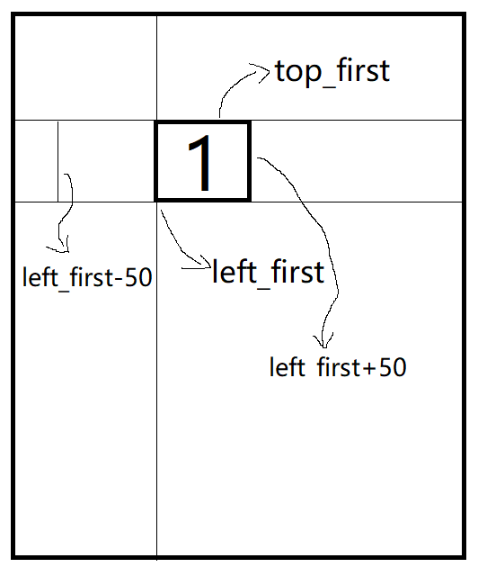

*单位：px*

**思路：**验证区域为260×262大小。

右上角设置两个字，他们构成一个数组。`array = [字1, 字2]`

不妨设一数组candidate，在里面放预选字，每次从candidate中抽取两个不同的字作为array.

设置两个50×50的块，每个块内有一需点击的汉字（字1，字2），每个块位置随机，且互不重叠。

点击相应的块之后会把该字push到数组末尾（为了直观，并使该块变色），点击确定之后与array进行比较，若相等，通过验证。

点击刷新之后会更新array，更新块的位置、及其内容，恢复其初始颜色。



确定之后块1之后需确保其与块2不重叠，即把块2的left设置在**[0,left_first-50]∪[left_first+50,210]**即可，top随机。

```javascript
function createDistance(n) {
    //0到n的随机整数
    return Math.round(Math.random()*n);
}

function createCandidateArray() {
    const candidate = ['一','二','三','四','五','六','七','八','九','十'];
    let choose_one = createDistance(9);
    let choose_two;
    while (true){
        choose_two = createDistance(9);
        if(choose_two!==choose_one) {break;}
    }
    return [candidate[choose_one],candidate[choose_two]];
    //返回两个候选字
}
```

